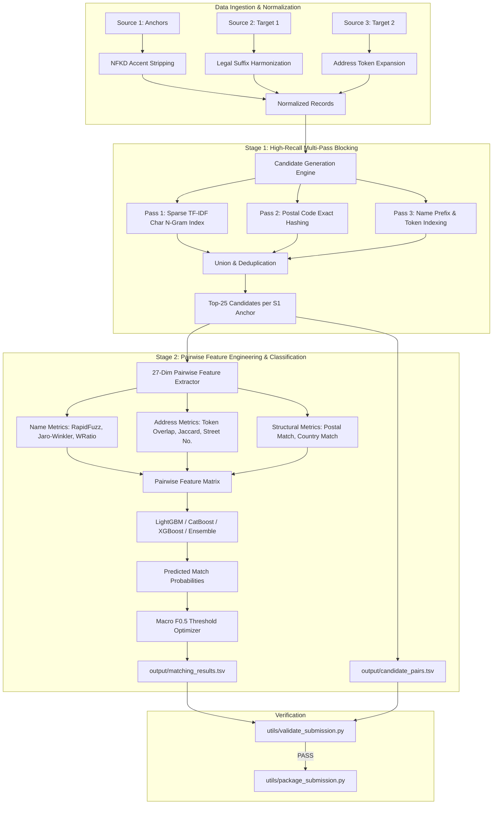

# Amazon ML Challenge 2026: Business Entity Resolution at Scale

[](https://www.python.org/downloads/)
[](https://opensource.org/licenses/MIT)
[]()

This repository contains the complete, production-grade, two-stage entity resolution pipeline developed for the **Amazon ML Challenge 2026: Business Entity Resolution**.

---

## 📌 Problem Overview & Core Challenge

In enterprise commercial catalogs, records describing the same business entity arrive across disparate, independent sources without universal primary keys. Entity Resolution (ER) aims to link all corresponding records from secondary sources to a primary reference catalog.

- **Anchor Source (`Source 1: S1-*`)**: ~2.2M deduplicated ground-truth reference businesses.
- **Target Sources (`Source 2: S2-*` & `Source 3: S3-*`)**: ~10.3M noisy candidate records to resolve.
- **Comparison Space**: $2.2\text{M} \times 10.3\text{M} \approx 22.6\text{ trillion}$ candidate pairs.
- **Open-Set Generalization**: Training covers **US** and **India**; the unlabelled test set introduces a third country, **France**. Preprocessing and tokenizers are strictly country-agnostic.
- **Real-World Noise**: Heavy legal suffix inconsistencies (`Pvt Ltd`, `LLC`, `GmbH`, `SARL`), street abbreviations (`Rd`/`Road`, `Ave`/`Avenue`), missing postal codes, OCR typos, and transliteration noise.

### 🎯 Evaluation Metric: Macro-Averaged $F_{0.5}$ Score

Submissions are evaluated on **Macro-averaged $F_{\beta}$ Score ($\beta = 0.5$)**:

$$F_{0.5} = \frac{(1 + 0.5^2) \times \text{Precision} \times \text{Recall}}{0.5^2 \times \text{Precision} + \text{Recall}} = \frac{1.25 \times \text{Precision} \times \text{Recall}}{0.25 \times \text{Precision} + \text{Recall}}$$

- **Precision-Weighted (2:1)**: False positive merges (incorrectly linking two distinct businesses) are penalized twice as harshly as false negative misses.
- **Singleton Entities**: Entities in Source 1 with zero true matches score **1.0** when correctly predicted with an empty match list (`""`), and **0.0** if any false match is predicted.

---

## 🏗️ Two-Stage Funnel Architecture



1. **Stage 1 (Candidate Generation / Blocking)**:
   - Reduces the 22.6 trillion comparison space down to $\sim 20\text{--}25$ high-quality candidates per entity using sparse character $3\text{--}5$ n-gram inverted indexing via `sparse_dot_topn`.
   - Achieves $\ge 97\%$ validation blocking recall ceiling in linear time.
2. **Stage 2 (Pairwise Scoring & Decision Calibration)**:
   - Extracts a 27-dimensional feature vector per candidate pair.
   - Evaluates tree ensembles (**LightGBM**, **CatBoost**, **XGBoost**, and soft-voting **Ensembles**).
   - Calibrates an optimal decision threshold $\tau^* \in [0.65, 0.85]$ to aggressively maximize Macro $F_{0.5}$ and guarantee $1.0$ accuracy on singletons.

---

## 👥 Team Work Distribution

| Role | Assignee | Primary Responsibilities |
|:---|:---|:---|
| **Role 1: Team Lead & Submitter** | **Parth Gupta** | Project Architecture, Code Reviews, Unstop Portal Submissions, Score Tracking |
| **Role 2: ML Pipeline & Tuning** | **Abhishek Mehta** | Full-Scale Pipeline Execution, Hyperparameter Tuning, Threshold Grid Search |
| **Role 3: EDA & Feature Engineering** | **Harshvardhan Salve** | Exploratory Data Analysis, Failure Mode Analysis, Custom Pairwise Features |
| **Role 4: Documentation & Ensembling** | **Parv Tiwari** | Methodology Report (`Documentation_template.md`), CatBoost / XGBoost Ensembles, README |

---

## 🛠️ Environment Setup & Installation

### 1. Clone the Repository
```bash
git clone https://github.com/Parth-Gupta-github/Business-Entity-Resolution-.git
cd Business-Entity-Resolution-
```

### 2. Set Up Python Virtual Environment
We recommend Python 3.10+ (tested on Python 3.11):

#### On Windows (PowerShell):
```powershell
python -m venv .venv
.\.venv\Scripts\Activate.ps1
pip install --upgrade pip
pip install -r requirements.txt
```

#### On Linux / macOS:
```bash
python3 -m venv .venv
source .venv/bin/activate
pip install --upgrade pip
pip install -r requirements.txt
```

---

## 🗂️ Dataset Placement

Place the challenge dataset files in the following structure (strictly ignored by `.gitignore`):

```text
dataset/
├── train/
│   ├── train_source1.tsv           # Anchor training records (~2.2M)
│   ├── train_source2.tsv           # Target source 2 (~5.1M)
│   ├── train_source3.tsv           # Target source 3 (~5.2M)
│   └── train_ground_truth.tsv      # True matching labels
└── test/
    ├── test_source1.tsv            # Anchor test records (~1.73M)
    ├── test_source2.tsv            # Target test source 2 (~5.1M)
    └── test_source3.tsv            # Target test source 3 (~5.2M)
```

---

## 🚀 Step-by-Step Reproduction Guide

### Option A: Complete End-to-End Run (Recommended)

To train on the full training dataset, optimize the decision threshold on validation holdout, and run test inference to produce both submission files:

```bash
# Default LightGBM model
python code/business_entity_resolution/src/pipeline.py --mode full --model lightgbm

# High-accuracy Tri-Ensemble model (0.5 LightGBM + 0.3 CatBoost + 0.2 XGBoost)
python code/business_entity_resolution/src/pipeline.py --mode full --model ensemble
```

### Option B: Validation & Tuning Run Only

To run preprocessing, blocking, feature extraction, and threshold optimization on the 80/20 train/validation split without running test inference:

```bash
python code/business_entity_resolution/src/pipeline.py --mode val_only --model lightgbm
```

To run a comparative benchmark across all 4 architectures (**LightGBM**, **CatBoost**, **XGBoost**, and **Ensemble**) during validation:

```bash
python code/business_entity_resolution/src/pipeline.py --mode val_only --benchmark
```

### Option C: Test Inference Only

If model checkpoints are already saved in `checkpoints/`:

```bash
python code/business_entity_resolution/src/pipeline.py --mode test_only --model lightgbm
```

### Option D: Standalone Model Benchmarking

To benchmark LightGBM, CatBoost, XGBoost, and Ensembles on an extracted representative slice:

```bash
python code/business_entity_resolution/src/benchmark_models.py
```

---

## 🧪 Submission Validation & Packaging

### 1. Validate Formats Locally
Before uploading to Unstop, run the official validation script:

```bash
python utils/validate_submission.py \
    --matching output/matching_results.tsv \
    --candidate output/candidate_pairs.tsv \
    --test-dir dataset/test
```

The validator verifies:
- Exactly one row per test Source 1 entity.
- Empty string for predicted singletons.
- No duplicate candidate IDs in any row.
- All predicted matches are a strict subset of candidate pairs.

### 2. Package Submission ZIP
To create the official submission archive containing code, outputs, and documentation:

```bash
python utils/package_submission.py
```

This generates `<team_name>_submission.zip` matching the required directory format:
```text
<team_name>_submission.zip
├── output/
│   ├── matching_results.tsv
│   └── candidate_pairs.tsv
├── code/
│   └── business_entity_resolution/
│       ├── src/
│       ├── README.md
│       └── requirements.txt
└── Documentation_template.md
```

---

## 📁 Repository Structure

```text
Business-Entity-Resolution-/
├── .gitignore                          # Ignores large datasets, caches, checkpoints
├── requirements.txt                    # Root environment dependencies
├── README.md                           # Comprehensive reproduction guide
├── Documentation_template.md           # Official competition methodology report
├── TEAM_WORK_DISTRIBUTION.md           # Team roles & parallel execution tracker
├── PROGRESS_CHECKLIST.md               # Task progression tracker
├── utils/
│   ├── validate_submission.py          # Official submission validator
│   └── package_submission.py           # Automated ZIP packager
├── code/
│   └── business_entity_resolution/
│       ├── requirements.txt            # Isolated submission requirements
│       ├── README.md                   # Submission reproduction guide
│       ├── ARCHITECTURE_AND_PLAN.md    # Detailed architecture specification
│       └── src/
│           ├── __init__.py
│           ├── config.py               # Central paths & hyperparameters
│           ├── preprocess.py           # Text/address cleaner & NFKD normalizer
│           ├── blocking.py             # Multi-pass candidate generation engine
│           ├── features.py             # 27-dimensional pairwise feature extractor
│           ├── models.py               # LightGBM, CatBoost, XGBoost, Ensemble
│           ├── metrics.py              # Macro F0.5 evaluator with singleton handling
│           ├── pipeline.py             # Main end-to-end pipeline orchestrator
│           └── benchmark_models.py     # Comparative model benchmark script
└── output/                             # Generated submission files (git-ignored)
    ├── matching_results.tsv            # Leaderboard matches
    └── candidate_pairs.tsv             # Blocking candidate set
```
