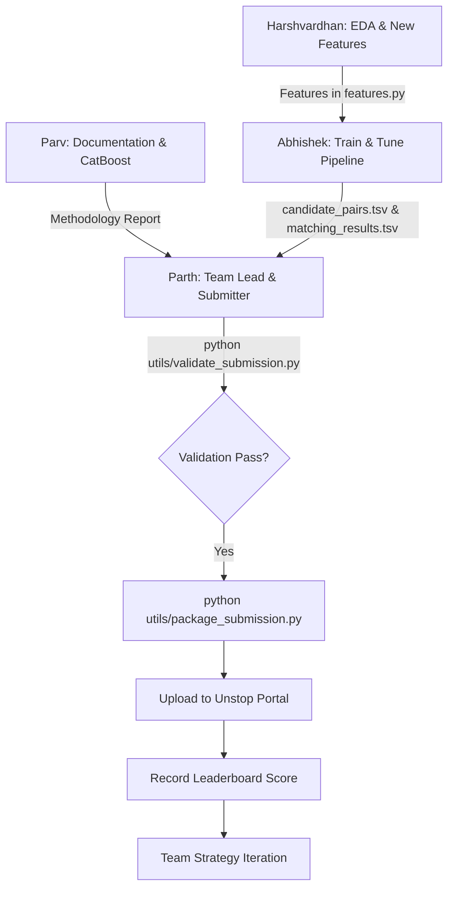

# Team Work Distribution — Amazon ML Challenge 2026

**Team Size**: 4 members  
**Project Status**: ✅ **Core Pipeline Built, Tested & Verified (Smoke test passed end-to-end in 88s with Macro F₀.₅ = 0.995)**.  
**Objective**: Scale to full dataset, engineer high-impact features, optimize thresholds, complete competition documentation, and submit to Unstop for top leaderboard ranking.

---

## 👥 Executive Overview: Roles & Responsibilities

| Role | Assignee | Focus Area | Immediate Action |
|:---|:---|:---|:---|
| **Role 1: Team Lead & Submitter** | **Parth Gupta** | Project Architecture, Code Review, Final Validation, Unstop Submissions & Score Tracking | Monitor pipeline, validate candidate/match outputs, upload to Unstop |
| **Role 2: ML Pipeline & Tuning** | **Abhishek Mehta** | Full Dataset Training, Hyperparameter Tuning, Threshold Search | Clone repo, run full pipeline, optimize LightGBM & threshold |
| **Role 3: EDA & Feature Engineering** | **Harshvardhan Salve** | Exploratory Analysis, Error/False-Positive Analysis, RapidFuzz/Domain Feature Additions | Run EDA scripts, study missed matches, add 3-5 custom features in `features.py` |
| **Role 4: Documentation & Ensembling** | **Parv Tiwari** | Amazon ML `Documentation_template.md`, CatBoost/XGBoost Experiments, README | Fill methodology doc, benchmark CatBoost vs LightGBM |

---

## 🟢 Role 1: Team Lead & Submitter — Parth Gupta

**Primary Objective**: Manage the repository, review deliverables, perform final safety checks, and submit final predictions to Unstop.

### Key Responsibilities
1. **Repository & Codebase Gatekeeping**:
   - Maintain stability on `main` branch.
   - Review feature additions from Harshvardhan and model tuning from Abhishek.
2. **Quality Assurance & Verification**:
   - Run submission validation before every Unstop upload:
     ```bash
     python utils/validate_submission.py output/candidate_pairs.tsv output/matching_results.tsv
     ```
   - Package the submission ZIP bundle:
     ```bash
     python utils/package_submission.py
     ```
3. **Unstop Submissions & Strategy**:
   - Upload official submission files to the Unstop portal (up to 5 submissions/day).
   - Log leaderboard score progression, precision, recall, and F₀.₅ in a shared tracker.
   - Guide the team on what to iterate next based on leaderboard feedback.
4. **Final Submission Package**:
   - Review Parv's completed `Documentation_template.md` (PDF/doc format as required).
   - Package the final code bundle, documentation report, and model checkpoints.

---

## 🔵 Role 2: ML Pipeline Execution & Model Tuning — Abhishek Mehta

**Primary Objective**: Execute full-scale training on the entire dataset, tune LightGBM parameters, and find the optimal classification threshold.

### Prerequisites & Setup
```bash
git clone https://github.com/Parth-Gupta-github/Business-Entity-Resolution-.git
cd Business-Entity-Resolution-
pip install -r requirements.txt
```

### Key Tasks
1. **Run Full Pipeline Execution**:
   - Execute the end-to-end pipeline:
     ```bash
     python -u code/business_entity_resolution/src/pipeline.py
     ```
   - Monitor memory usage, blocking recall on validation holdout, and training loss.
2. **Hyperparameter Tuning (LightGBM)**:
   - Experiment with parameters in `code/business_entity_resolution/src/models.py`:
     - `learning_rate` (0.03, 0.05, 0.1)
     - `num_leaves` (31, 63, 127)
     - `min_child_samples` (20, 50, 100)
     - `scale_pos_weight` / class weights (handling 1:10 negative:positive ratio)
3. **Threshold Grid Search (Maximizing Macro F₀.₅)**:
   - Run fine-grained threshold search from $\tau \in [0.60, 0.90]$ with step `0.01`.
   - Remember: Macro F₀.₅ heavily penalizes False Positives (weights Precision 2× over Recall). Singletons score 1.0 when no match is predicted.
4. **Deliver Outputs to Parth**:
   - Provide `output/candidate_pairs.tsv` and `output/matching_results.tsv`.
   - Provide the best validation metrics log and threshold $\tau^*$.

### Deliverables
- ✅ Full pipeline execution logs
- ✅ Best trained model checkpoint (`checkpoints/lgbm_model.txt`)
- ✅ Verified `candidate_pairs.tsv` & `matching_results.tsv` ready for Parth to validate and submit

---

## 🟡 Role 3: Data Analysis & Feature Engineering — Harshvardhan Salve

**Primary Objective**: Discover patterns, failure modes, and build additional high-signal similarity features in `features.py`.

### Prerequisites & Setup
```bash
git clone https://github.com/Parth-Gupta-github/Business-Entity-Resolution-.git
cd Business-Entity-Resolution-
pip install -r requirements.txt
```

### Key Tasks
1. **Exploratory Data Analysis (EDA)**:
   - Analyze Source 1, 2, and 3 distributions:
     - Missing value rates across `business_name`, `business_address`, `country`.
     - Singleton entity percentage in `train_ground_truth.tsv`.
     - Distribution of multi-source matches (e.g. S1 matching both S2 and S3 vs only S2).
2. **Error & Failure Mode Analysis**:
   - Analyze false positives (wrong predictions) and false negatives (missed matches).
   - Identify edge cases: legal entity suffix variations (Inc, LLC, Corp, GmbH, Ltd, Pvt Ltd), street name abbreviations (St, Rd, Ave, Blvd, Suite), transliteration noise.
3. **Feature Engineering in `code/business_entity_resolution/src/features.py`**:
   - Add new pairwise signals:
     - **Exact Number Match**: Check if house/building numbers match in address.
     - **First-Word / Core-Token Exact Match**: Business name head word equality.
     - **Length Difference Ratio**: Absolute and relative difference in token lengths.
     - **Character 3-gram Jaccard / Overlap coefficient**.
     - **Country / City Consistency Flag**: Strong penalty if countries conflict.
4. **Benchmarking Features**:
   - Test feature importance via LightGBM feature gain plots.
   - Commit validated improvements to `features.py`.

### Deliverables
- ✅ EDA summary script / notebook
- ✅ Top failure cases analysis report
- ✅ 3 to 5 new engineered features integrated into `features.py`

---

## 🟣 Role 4: Documentation & Alternative Model Experiments — Parv Tiwari

**Primary Objective**: Write the comprehensive methodology report based on `Documentation_template.md` and benchmark alternative models (CatBoost / XGBoost / Ensembling).

### Prerequisites & Setup
```bash
git clone https://github.com/Parth-Gupta-github/Business-Entity-Resolution-.git
cd Business-Entity-Resolution-
pip install -r requirements.txt
pip install catboost xgboost
```

### Key Tasks
1. **Competition Documentation (`Documentation_template.md`)**:
   - Complete all sections of `Documentation_template.md`:
     - **Executive Summary**: Core methodology and high-level pipeline design.
     - **Data Preprocessing & Normalization**: Legal suffix stripping, unicode NFKD normalization, address token standardization.
     - **Two-Stage Scalable Architecture**:
       - *Stage 1 (Blocking)*: Multi-field TF-IDF character n-gram (3-5) sparse matrix multiplication with Top-K candidates.
       - *Stage 2 (Classification)*: Gradient Boosted Decision Trees on pairwise feature vector.
     - **Evaluation Metric Alignment**: Detailed explanation of Macro F₀.₅ optimization and handling of singleton entities.
     - **Ablation Studies & Validation Results**: Table comparing baseline vs full feature set vs tuned threshold.
2. **Alternative Model Exploration (CatBoost / XGBoost)**:
   - Implement an alternative model pipeline or blending script in `models.py`.
   - Test if an ensemble (e.g., $0.6 \times \text{LightGBM} + 0.4 \times \text{CatBoost}$) improves validation Macro F₀.₅.
3. **Repository Finalization & README**:
   - Update root `README.md` with clear reproduction steps, environment setup, and pipeline commands.

### Deliverables
- ✅ Completed `Documentation_template.md` ready for submission PDF conversion
- ✅ Comparative benchmark report (LightGBM vs CatBoost / Ensemble)
- ✅ Polished `README.md`

---

## 🚀 Ready-to-Send Copy-Paste Messages for Team Members

### 📩 Message for Abhishek Mehta (Role 2: Pipeline & Tuning)
```text
Hey Abhishek! The core pipeline for the Amazon ML Challenge is ready and verified (smoke test passed end-to-end with 0.995 F0.5 score). 

Your role is ML Pipeline Execution & Tuning:
1. Clone the repo: git clone https://github.com/Parth-Gupta-github/Business-Entity-Resolution-.git
2. Install dependencies: pip install -r requirements.txt
3. Run the full training pipeline: python -u code/business_entity_resolution/src/pipeline.py
4. Experiment with LightGBM hyperparameters (learning rate, num_leaves, min_child_samples) in code/business_entity_resolution/src/models.py
5. Optimize the classification threshold tau between 0.60 and 0.90 to maximize Macro F0.5.
6. Once your run completes, send me candidate_pairs.tsv and matching_results.tsv along with your validation score, and I'll validate and upload it to Unstop.

Check out TEAM_WORK_DISTRIBUTION.md in the repo for full instructions!
```

### 📩 Message for Harshvardhan Salve (Role 3: EDA & Features)
```text
Hey Harshvardhan! The codebase for our Amazon ML Entity Resolution project is set up and working. 

Your role is Data Analysis & Feature Engineering:
1. Clone the repo: git clone https://github.com/Parth-Gupta-github/Business-Entity-Resolution-.git
2. Install dependencies: pip install -r requirements.txt
3. Run EDA on Source 1, 2, 3 and train_ground_truth.tsv to analyze singleton %, missing values, and entity distributions.
4. Inspect false positive / false negative edge cases (e.g. legal suffix mismatches, address number differences).
5. Add 3-5 high-signal features in code/business_entity_resolution/src/features.py (e.g. exact address number match, token overlap ratios, core name Jaccard).
6. Let us know which features boost validation score so we can incorporate them into the main training run!

Check out TEAM_WORK_DISTRIBUTION.md in the repo for full details!
```

### 📩 Message for Parv Tiwari (Role 4: Documentation & Models)
```text
Hey Parv! The pipeline architecture for our Amazon ML Challenge solution is completely built and tested.

Your role is Documentation & Model Exploration:
1. Clone the repo: git clone https://github.com/Parth-Gupta-github/Business-Entity-Resolution-.git
2. Open Documentation_template.md and fill in our methodology report (all architectural details are in code/business_entity_resolution/ARCHITECTURE_AND_PLAN.md).
3. Document our two-stage approach: Multi-field TF-IDF n-gram blocking + LightGBM pairwise classifier + Macro F0.5 precision-weighted thresholding.
4. (Optional / Bonus) Test training a CatBoost / XGBoost model on the extracted features to see if an ensemble gives an extra boost.
5. Update the main README.md with clear step-by-step reproduction instructions.

Check out TEAM_WORK_DISTRIBUTION.md in the repo for all the guidance!
```

---

## 🔄 Collaboration & Submission Workflow


