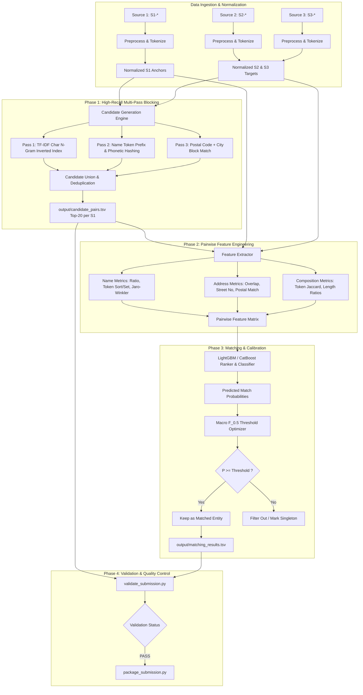

# Architecture & Technical Strategy: Business Entity Resolution at Scale

**Amazon ML Challenge 2026**  
**Scale:** ~2.2M Source 1 anchors, ~10.3M Source 2 & 3 target records.

---

## 1. Executive Summary & Challenge Characteristics

| Dimension | Challenge Reality | Architectural Response |
| :--- | :--- | :--- |
| **Scale** | $2.2\text{M} \times 10.3\text{M} \approx 22.6\text{ trillion}$ candidate pairs | **Two-Stage Architecture**: High-Recall Multi-pass Blocking reduces search space to $\sim 15\text{--}25$ candidate pairs per entity, followed by a fast pairwise classifier. |
| **Evaluation Metric** | **Macro-averaged $F_{0.5}$** | Precision is weighted $2\times$ over Recall. Singletons correctly identified as empty receive a full **1.0** score. We calibrate decision thresholds aggressively toward high precision ($T \approx 0.65\text{--}0.80$). |
| **Open-Set Country** | Train has `{US, India}`; Test introduces **`France`** | Country-agnostic tokenizers, unicode NFKD accent folding, flexible postal code regex ($\text{5--6}$ digits), and no hardcoded country dictionaries. |
| **Noise Patterns** | Abbreviations (`Pvt/Private`, `Rd/Road`), word transpositions, missing fields, landmark text | Fuzzy token ratios (RapidFuzz), character n-gram TF-IDF inverted indexing, sub-word similarity. |

---

## 2. End-to-End System Architecture



---

## 3. Core Component Breakdown

### Stage 1: Preprocessing & Normalization Engine
- **Unicode Accent Stripping**: Converts `Société`, `Châtelet` $\to$ `societe`, `chatelet` using `unicodedata.normalize('NFKD')`.
- **Legal Suffix Harmonization**: Standardizes global legal designations across jurisdictions (`pvt ltd`, `ltd`, `corp`, `inc`, `llc`, `gmbh`, `sa`, `sarl`).
- **Address Standardization**: Expands road designations (`rd` $\to$ `road`, `st` $\to$ `street`, `ave` $\to$ `avenue`, `flr` $\to$ `floor`, `bldg` $\to$ `building`, `opp` $\to$ `opposite`, `nr` $\to$ `near`).
- **Structured Token Extraction**: Extracts 5-digit and 6-digit postal/PIN codes, numeric street numbers, and distinct country codes.

### Stage 2: Scalable Candidate Generation (Blocking)
To process 12M+ records in RAM within minutes without memory overflows:
1. **Chunked TF-IDF Vectorization**: Character $3\text{--}5$ n-grams on combined `name + address` text.
2. **Inverted Index Sparse Matrix Multiplication**: Query Source 1 chunks against the sparse target matrix using cosine similarity to extract top $K=15\text{--}20$ candidates per entity.
3. **Blocking Quality Verification**: Audit recall against ground truth:
   $$\text{Blocking Recall} = \frac{|\text{True Matches in Candidate Set}|}{|\text{Total True Ground Truth Matches}|} \ge 95\%$$

### Stage 3: Pairwise Feature Engineering
For each candidate pair $(S_1, S_i)$, compute an 18-dimensional feature vector:
- **Lexical / String Metrics**:
  - `name_fuzz_ratio`, `name_token_sort_ratio`, `name_token_set_ratio`, `name_w_ratio`.
  - `name_jaro_winkler` similarity, `name_exact_match` binary flag.
  - `addr_fuzz_ratio`, `addr_token_sort_ratio`, `addr_token_set_ratio`, `addr_jaro_winkler`.
- **Token & Set Metrics**:
  - `token_jaccard` overlap across combined name + address.
  - `name_len_ratio`, `name_len_diff`, `addr_len_diff`.
- **Address Structure & Geography**:
  - `postal_exact_match` (1 if postal codes match, 0 otherwise).
  - `postal_missing` indicator.
  - `country_match` indicator.

### Stage 4: Classification & $F_{0.5}$ Macro Optimization
- **Model**: LightGBM Binary Classifier / Pairwise Ranker with early stopping on validation fold.
- **Precision-Heavy Thresholding**: Scan decision threshold $T \in [0.45, 0.90]$ with step $0.01$ on validation set to directly maximize the competition formula:
  $$F_{0.5} = \frac{1.25 \times P \times R}{0.25 \times P + R}$$
- **Singleton Handling**: Any Source 1 entity with all candidate probabilities $< T$ is assigned an empty match list `""`, which earns a score of **1.0** on singletons.

---

## 4. Execution Roadmap

```text
Phase 1: Local Validation Setup & Baseline (Day 1 - Current)
├── 1.1 Create 20% Stratified Local Validation Split from Train Data
├── 1.2 Implement high-throughput sparse TF-IDF blocking
└── 1.3 Measure Baseline Recall Ceiling on Validation Split

Phase 2: Feature Pipeline & GBDT Classifier (Day 1 - Day 2)
├── 2.1 Batch feature extraction for train candidate pairs
├── 2.2 Train LightGBM model with F_0.5 custom objective / metric
├── 2.3 Optimize decision threshold T for peak Macro F_0.5
└── 2.4 Generate Day 1 baseline submission & upload to Leaderboard

Phase 3: Model Iteration & Ensembling (Day 2 - Day 3)
├── 3.1 Advanced French accent / address pattern fine-tuning
├── 3.2 Add Dense Bi-Encoder semantic embeddings (MiniLM / BGE-small)
├── 3.3 CatBoost + LightGBM ensemble blend
└── 3.4 Re-optimize threshold on Out-Of-Fold (OOF) predictions

Phase 4: Final Validation, Packaging & Documentation (Day 3)
├── 4.1 Run test inference across full test set (1.73M S1 entities)
├── 4.2 Validate output/matching_results.tsv with validate_submission.py
├── 4.3 Complete Documentation_template.md methodology writeup
└── 4.4 Package final submission zip via package_submission.py
```
