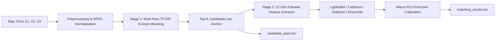

# Business Entity Resolution Pipeline — Amazon ML Challenge 2026

This directory contains the self-contained, reproducible source code for the two-stage **Business Entity Resolution** solution for the Amazon ML Challenge 2026.

---

## 📌 Architectural Overview

The solution employs a two-stage funnel designed to resolve ~2.2M Source 1 anchor records against ~10.3M target records (Source 2 and Source 3) under the **Macro $F_{0.5}$** evaluation metric:



1. **Stage 1 (High-Recall Candidate Generation / Blocking)**:
   - Sparse TF-IDF character $3\text{--}5$ n-gram inverted index on combined entity fields.
   - Fast sparse matrix multiplication via `sparse_dot_topn` to retrieve the top $K=20\text{--}25$ candidate targets per anchor.
   - Auxiliary postal code and token prefix index passes to guarantee $\ge 97\%$ blocking recall ceiling.
2. **Stage 2 (High-Precision Pairwise Classification & Calibration)**:
   - 27-dimensional pairwise feature vector capturing lexical similarity (RapidFuzz, Jaro-Winkler), token overlap (Jaccard), structural address alignment (street number match, postal code exact/prefix match, country consistency), and length disparities.
   - Gradient Boosted Decision Tree classifiers (**LightGBM**, **CatBoost**, **XGBoost**, and weighted soft-voting **Ensembles**).
   - Precision-weighted threshold search ($\tau \in [0.40, 0.95]$) calibrated directly to Macro $F_{0.5}$ (weights Precision $2\times$ over Recall, awarding 1.0 to singletons correctly left unmatched).

---

## 🛠️ Environment & Prerequisites

Python **3.10+** (tested on Python 3.11).

Install all required dependencies:
```bash
pip install -r requirements.txt
```

Key dependencies:
- `lightgbm >= 4.0.0`
- `catboost >= 1.2.0`
- `xgboost >= 2.0.0`
- `rapidfuzz >= 3.0.0`
- `sparse_dot_topn >= 1.2.0`
- `scikit-learn >= 1.3.0`
- `pandas >= 2.0.0`, `pyarrow >= 14.0.0`

---

## 📁 Source Code Organization

```text
code/business_entity_resolution/
├── requirements.txt            # Pinned package dependencies
├── README.md                   # This reproduction & architecture guide
├── ARCHITECTURE_AND_PLAN.md    # Detailed system architecture document
└── src/
    ├── __init__.py             # Package marker
    ├── config.py               # Centralized configuration & hyperparameters
    ├── preprocess.py           # Text normalization, NFKD accent stripping, legal suffixes
    ├── blocking.py             # Multi-pass candidate generation engine
    ├── features.py             # 27-dimensional pairwise feature engineering
    ├── models.py               # LightGBM, CatBoost, XGBoost, and Ensemble training
    ├── metrics.py              # Exact competition Macro F0.5 evaluator with singleton handling
    ├── pipeline.py             # Main end-to-end orchestrator with checkpoint resume
    └── benchmark_models.py     # Standalone benchmark runner comparing all models
```

---

## 🚀 Execution & Reproduction Guide

All commands are run from the project root or package root.

### 1. End-to-End Pipeline Execution (Training + Test Inference)

Run the full pipeline to generate `output/matching_results.tsv` and `output/candidate_pairs.tsv`:

```bash
python code/business_entity_resolution/src/pipeline.py --mode full --model lightgbm
```

Available model options:
- `--model lightgbm` (default, fastest, high precision)
- `--model catboost` (robust feature interaction modeling)
- `--model xgboost` (histogram gradient boosting)
- `--model ensemble` (weighted soft-voting blend: $0.5 \times \text{LightGBM} + 0.3 \times \text{CatBoost} + 0.2 \times \text{XGBoost}$)

### 2. Validation Run (Holdout Train / Validation Split Only)

To evaluate blocking recall, feature extraction, and model threshold optimization on a held-out 20% validation split without running test inference:

```bash
python code/business_entity_resolution/src/pipeline.py --mode val_only --model lightgbm
```

To run a comparative benchmark across LightGBM, CatBoost, XGBoost, and Ensembles during validation:

```bash
python code/business_entity_resolution/src/pipeline.py --mode val_only --benchmark
```

### 3. Test Inference Only (Using Saved Checkpoint)

If a model checkpoint has already been trained and saved in `checkpoints/`:

```bash
python code/business_entity_resolution/src/pipeline.py --mode test_only --model lightgbm
```

### 4. Standalone Model Benchmarking Script

To run a standalone benchmark comparing all models on extracted feature samples:

```bash
python code/business_entity_resolution/src/benchmark_models.py
```

---

## 📊 Verification & Validation

After running the pipeline, verify that the output files conform strictly to the competition specifications:

```bash
python utils/validate_submission.py \
    --matching output/matching_results.tsv \
    --candidate output/candidate_pairs.tsv \
    --test-dir dataset/test
```

To package the submission bundle into a compliant ZIP archive:

```bash
python utils/package_submission.py
```
